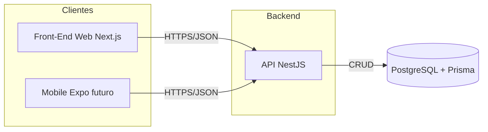

# DSM-G07-PI6-2026-2

Repositório do **GRUPO 07** do Projeto Interdisciplinar do 6º semestre DSM 2026/2.

**Alunos:** Thiago Cunha, Paulo Ricardo, Vinícius de Araújo e Patrícia Nogueira

**Instituição:** Fatec Franca — "Dr. Thomaz Novelino" (Centro Paula Souza)

---

## Visão do produto

Plataforma multiplataforma (Web e Mobile) de **mineração de dados agrícolas e climáticos do café**. O sistema cruza dados meteorológicos com registros de produtividade para gerar inteligência de negócios aos produtores rurais — via dashboard web e, futuramente, app mobile em campo.

Documentação completa da Sprint 1: [documentacao-sprint1.md](./docs/documentacao-sprint1.md)

---

## Stack

| Camada | Tecnologia |
| --- | --- |
| API | NestJS (Node.js) |
| ORM / DB | Prisma + PostgreSQL |
| Web | Next.js (React) |
| Mobile (planejado) | React Native / Expo |
| Analítico (planejado) | Python (clustering / regressão) |
| Infra local | Docker Compose |
| Nuvem (planejado) | Azure VMs + GitHub Actions |

---

## Estrutura do repositório

```
/
├── backend/                 # API NestJS + Prisma
├── web/                     # Protótipo Next.js (telas estáticas)
├── mobile/                  # Protótipo React Native + Expo
├── docker-compose.yml       # PostgreSQL local
├── docs/                    # Documentação das sprints
│   └── documentacao-sprint1.md
└── .cursor/rules/           # Regras de negócio para o agente
```

---

## Arquitetura (resumo)



---

## Como subir localmente

### Pré-requisitos

- Node.js 20+
- Docker Desktop em execução (necessário para o PostgreSQL)

### 1. Banco de dados

```bash
docker compose up -d
```

Se o comando falhar, abra o **Docker Desktop** e tente de novo.
### 2. Back-end

```bash
cd backend
cp .env.example .env
npm install
npx prisma migrate dev
npm run start:dev
```

- API: `http://localhost:3001`
- Swagger: `http://localhost:3001/api`

### 3. Front-end (web)

```bash
cd web
npm install
npm run dev
```

- App: `http://localhost:3000`

### 4. Aplicativo mobile

```bash
cd mobile
npm install
npm start
```

O app inicia em modo demonstração com dados mockados. Para consumir a API, copie `mobile/.env.example` para `mobile/.env` e defina `EXPO_PUBLIC_USE_API=true`. Em dispositivo físico, use o IP local da máquina no `EXPO_PUBLIC_API_URL` em vez de `localhost`.

---

## Sprint 1 vs. próximas sprints

| Escopo | Sprint |
| --- | --- |
| Escopo, modelagem, repo, NestJS + Prisma, Next.js estático, planejamento nuvem/mineração | **1** (atual) |
| K-Means / clusters | 2 |
| Regressão / predições de produtividade | 3 |
| App mobile Expo (protótipo navegável) | Sprint 1 |

---

## Entrega

**Data da 1ª Sprint:** 04/09/2026
