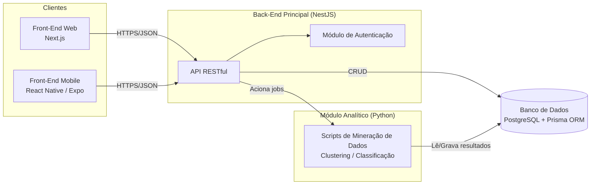
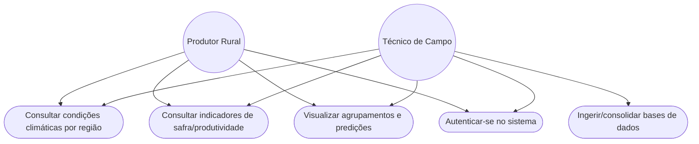

# Documentação da 1ª Sprint - Projeto Interdisciplinar (6º Semestre)

## Plataforma de Mineração de Dados Agrícolas e Climáticos do Café

**Instituição:** Faculdade de Tecnologia de Franca - "Dr. Thomaz Novelino" (Centro Paula Souza)

**Curso:** Desenvolvimento de Software Multiplataforma (DSM)

**Data de Entrega:** 04/09/2026

---

## 0. Checklist de Conformidade com as Entregas Mínimas da Sprint 1

De acordo com o cronograma oficial do PI, a 1ª Sprint (04/09/2026) exige as entregas mínimas abaixo. Esta seção mapeia cada exigência à seção correspondente deste documento:

| Entrega Mínima Exigida | Status | Seção de Referência |
| --- | --- | --- |
| Definição do escopo e requisitos (funcionais e não funcionais) | ✅ Concluído | Seção 1 |
| Modelagem inicial (diagramas de caso de uso, arquitetura ou equivalente) | ✅ Concluído | Seção 3 |
| Criação do repositório Grupo (GitHub) | ✅ Concluído | Seção 4 |
| Estrutura inicial do back-end (framework e API configurada) | ✅ Concluído | Seção 4 |
| Protótipo inicial do front-end (telas estáticas) | ✅ Concluído | Seção 4 |
| Banco de dados modelado (conceitual e lógico) | ✅ Concluído | Seção 2 |
| Computação em Nuvem II: definição e justificativa dos serviços em nuvem | ✅ Concluído | Seção 5 |
| Mineração de Dados: definição da base de dados e planejamento inicial das técnicas | ✅ Concluído | Seção 6 |

---

## 1. Definição do Escopo e Requisitos

O presente projeto consiste no desenvolvimento de uma solução de software **multiplataforma** (Web e Mobile) orientada à mineração de dados focada na cafeicultura, conectando-se diretamente com a realidade do agronegócio. A plataforma cruzará dados meteorológicos com registros de produtividade para prover inteligência de negócios aos produtores rurais, disponibilizando os resultados tanto em um dashboard web quanto em um aplicativo mobile para uso em campo.

### 1.1. Requisitos Funcionais (RF)

#### RF01 — Ingestão e Consolidação de Dados

- **RF01.1:** O sistema deve importar os arquivos CSV das bases "Coffee Data Set" e "Agriculture Crop Yield" (Kaggle) por meio de um script de ingestão em Python.
- **RF01.2:** O sistema deve identificar e tratar dados ausentes (*missing values*) nas colunas de temperatura, precipitação, umidade, radiação solar e rendimento antes da persistência.
- **RF01.3:** O sistema deve unificar os registros das duas bases utilizando região produtora e ano de colheita como chaves de correspondência (*join*).
- **RF01.4:** O sistema deve persistir os dados consolidados nas tabelas `Regiao_Produtora`, `Condicao_Climatica` e `Safra_Rendimento` do banco de dados relacional.

#### RF02 — Mineração de Dados (Módulo Analítico em Python)

- **RF02.1:** O sistema deve gerar matrizes de correlação entre as variáveis climáticas (temperatura, precipitação, umidade, radiação solar) e a variável de rendimento (toneladas/hectare).
- **RF02.2:** O sistema deve aplicar o algoritmo K-Means para segmentar as regiões produtoras em clusters conforme perfil climático (entrega prevista para a Sprint 2).
- **RF02.3:** O sistema deve aplicar um modelo supervisionado (regressão) para estimar a produtividade esperada a partir de variáveis climáticas de entrada (entrega prevista para a Sprint 3).
- **RF02.4:** O sistema deve armazenar os resultados de clusterização e de predição vinculados à `Regiao_Produtora` e ao `Ano_Colheita` correspondentes, para consulta posterior pela API.

#### RF03 — API RESTful (NestJS)

- **RF03.1:** A API deve expor o endpoint `GET /regioes`, com suporte a filtro por país, para listar as regiões produtoras cadastradas.
- **RF03.2:** A API deve expor o endpoint `GET /clima/:regiaoId`, retornando o histórico de condições climáticas da região informada.
- **RF03.3:** A API deve expor o endpoint `GET /safra/:regiaoId`, retornando o histórico de rendimento (toneladas/hectare) da região informada.
- **RF03.4:** A API deve expor o endpoint `GET /clusters`, retornando o agrupamento das regiões gerado pelo K-Means.
- **RF03.5:** A API deve expor o endpoint `GET /predicoes/:regiaoId`, retornando a estimativa de produtividade gerada pelo módulo analítico.
- **RF03.6:** A API deve documentar todos os endpoints via OpenAPI/Swagger.
- **RF03.7:** A API deve exigir autenticação (JWT) em todas as rotas, exceto nas rotas públicas de login e cadastro.

#### RF04 — Interface Web (Next.js)

- **RF04.1:** O dashboard deve exibir uma lista (ou mapa) das regiões produtoras cadastradas, com opção de seleção individual.
- **RF04.2:** O dashboard deve exibir gráficos de série temporal para temperatura, precipitação e rendimento da região selecionada.
- **RF04.3:** O dashboard deve exibir visualmente o agrupamento das regiões (clusters), com legenda por perfil climático.
- **RF04.4:** O dashboard deve exigir login do usuário antes de exibir dados de clima, safra, clusters ou predições.
- **RF04.5:** O dashboard deve permitir filtrar os dados exibidos por ano de colheita e por região.

#### RF05 — Aplicativo Mobile (React Native / Expo)

- **RF05.1:** O aplicativo deve permitir login/autenticação do produtor ou técnico de campo, utilizando o mesmo mecanismo de autenticação (JWT) da API.
- **RF05.2:** O aplicativo deve exibir, em tela simplificada, as condições climáticas mais recentes e o histórico de rendimento da(s) região(ões) vinculada(s) ao usuário autenticado.
- **RF05.3:** O aplicativo deve exibir o cluster e a predição de produtividade referentes à região do usuário.
- **RF05.4:** O aplicativo deve armazenar em cache local os últimos dados consultados, permitindo consulta parcial em modo offline.

#### RF06 — Gestão de Usuários e Permissões

- **RF06.1:** O sistema deve permitir o cadastro de usuários com perfis distintos: Administrador, Técnico de Campo e Produtor.
- **RF06.2:** O sistema deve restringir o acesso aos dados conforme o perfil do usuário: o Produtor visualiza apenas a(s) região(ões) à qual está vinculado; o Técnico pode visualizar múltiplas regiões sob sua responsabilidade; o Administrador tem acesso irrestrito.

### 1.2. Requisitos Não Funcionais (RNF)

- **RNF01 (Nuvem):** A infraestrutura deve ser provisionada em nuvem pública, visando alta disponibilidade e escalabilidade.
- **RNF02 (Arquitetura):** O sistema deve seguir o padrão de conteinerização via Docker.
- **RNF03 (Segurança):** As APIs devem ser protegidas por autenticação, garantindo que o banco de dados não seja exposto diretamente.
- **RNF04 (Multiplataforma):** O aplicativo mobile deve ser compatível com os sistemas operacionais Android e iOS a partir de uma única base de código.
- **RNF05 (Usabilidade Mobile):** A interface mobile deve priorizar leveza e desempenho, considerando possíveis condições de conectividade limitada em áreas rurais.

---

## 2. Modelagem Inicial e Banco de Dados

O banco de dados relacional foi escolhido para orquestrar as informações de forma transacional, utilizando o **Prisma ORM** para a modelagem lógica e o mapeamento objeto-relacional seguro e performático junto à API NestJS.

| Entidade Conceitual | Descrição / Atributos Principais |
| --- | --- |
| **Regiao_Produtora** | ID, Nome_Regiao, Pais, Coordenadas |
| **Condicao_Climatica** | ID, Regiao_ID, Data, Temperatura_Media, Precipitacao, Umidade, Radiacao_Solar |
| **Safra_Rendimento** | ID, Regiao_ID, Ano_Colheita, Dias_Crescimento, Rendimento_Toneladas_Hectare |

---

## 3. Arquitetura e Diagramas

A arquitetura de software desenhada contempla a separação clara de responsabilidades operacionais, incluindo o cliente mobile como uma nova camada de apresentação:

- **Front-End Web:** Next.js (React) provendo telas estáticas iniciais e, futuramente, painéis dinâmicos integrados à API.
- **Front-End Mobile:** React Native (via Expo), consumindo os mesmos endpoints REST expostos pelo NestJS, garantindo reaproveitamento de lógica de negócio e consistência de dados entre Web e Mobile.
- **Back-End Principal:** NestJS (Node.js), atuando como orquestrador, gerenciando o CRUD inicial de usuários e as requisições do sistema (tanto da aplicação web quanto do aplicativo mobile).
- **Módulo Analítico:** Scripts independentes desenvolvidos em Python, acionados pelo NestJS para execução de tarefas de Machine Learning.

### 3.1. Diagrama de Arquitetura

### 3.2. Diagrama de Caso de Uso

---

## 4. Repositório GitHub e Estrutura Inicial do Sistema

- **Repositório Oficial:** Em conformidade com as diretrizes do PI, o repositório inicial foi provisionado na organização GitHub oficial: `github.com/FatecFranca/....`
- **Estrutura Inicial do Back-End:** Projeto NestJS inicializado, com a API RESTful configurada e o Prisma ORM integrado ao banco de dados relacional (ver modelagem na Seção 2).
- **Protótipo Inicial do Front-End:** Aplicação Next.js inicializada com as telas estáticas iniciais (landing page e estrutura base do futuro dashboard).

---

## 5. Planejamento de Computação em Nuvem II

A infraestrutura em nuvem será construída com foco em resiliência, integração contínua e controle operacional. Os serviços e justificativas são:

- **Provedor e Computação:** Utilização de infraestrutura baseada em **Azure Virtual Machines (VMs)** para hospedar instâncias de contêineres, garantindo isolamento e performance dedicada entre os serviços web (Nest/Next), o motor de mineração (Python) e o backend consumido pelo aplicativo mobile.
- **Integração Contínua (CI/CD):** Implementação de pipelines automatizados (como GitHub Actions) para garantir a entrega contínua dos artefatos de back-end, além da geração de builds (Android/iOS) do aplicativo mobile.
- **Banco de Dados na Nuvem:** Configuração de banco de dados isolado com regras de rede estritas (Virtual Networks), onde apenas o backend NestJS possuirá permissão de acesso externo — tanto para requisições da Web quanto do Mobile.

---

## 6. Planejamento de Mineração de Dados

A base de dados oficial será composta pela unificação do **Agriculture Crop Yield** (Kaggle) e do **Coffee Data Set** (Kaggle). As técnicas planejadas para as próximas entregas incluem:

- **Fase Preliminar:** Tratamento de dados ausentes, construção de matrizes de correlação e visualizações (pairplots) em Python para entender as relações entre clima e produtividade.
- **Sprint 2 (Não Supervisionado):** Aplicação de algoritmos como K-Means para segmentar as regiões produtoras baseando-se em perfis climáticos (Clustering).
- **Sprint 3 (Supervisionado):** Implementação de um modelo preditivo utilizando características climáticas como entrada para estimar a variável alvo de produtividade (toneladas por hectare).

---

## 7. Planejamento do Módulo Mobile

Como extensão da plataforma, será desenvolvido um aplicativo mobile com o objetivo de levar os insights de mineração de dados diretamente ao produtor rural em campo.

- **Tecnologia:** React Native com Expo, permitindo build simultânea para Android e iOS a partir de uma única base de código, alinhado ao ecossistema JavaScript/TypeScript já utilizado no Front-End (Next.js) e Back-End (NestJS).
- **Consumo de API:** O app consumirá os mesmos endpoints RESTful do NestJS utilizados pelo dashboard web, evitando duplicação de regras de negócio.
- **Funcionalidades Previstas:**
  - Login/autenticação do produtor ou técnico de campo.
  - Consulta de condições climáticas e indicadores de safra por região.
  - Visualização simplificada dos agrupamentos (clusters) e predições geradas pelo módulo analítico em Python.
- **Considerações Técnicas:** Interface otimizada para conectividade instável, com possibilidade futura de cache local para consulta parcial em modo offline.
